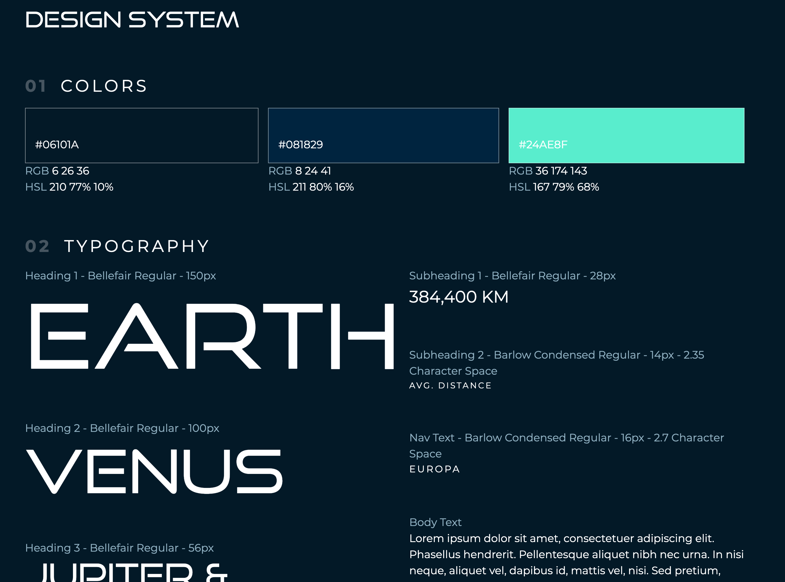

# Killer Whale Crypto Rebrand by Midway Web Development



## Getting Started

First install all dependencies:

```
npm i
```

Then run the development server:

```bash
npm run dev
# or
yarn dev
```

Open [http://localhost:3000](http://localhost:3000) with your browser to see the result.

[API routes](https://nextjs.org/docs/api-routes/introduction) can be accessed on [http://localhost:3000/api/hello](http://localhost:3000/api/hello). This endpoint can be edited in `pages/api/hello.js`.

The `pages/api` directory is mapped to `/api/*`. Files in this directory are treated as [API routes](https://nextjs.org/docs/api-routes/introduction) instead of React pages.

## Design System

To view the design system go to [http://localhost:3000/design](http://localhost:3000/design)

## Project Structure

### Components

A directory exsists to hold UI components. These components should contain very little logic. Props are passed to these components generally from "sections". The data passed from props is formatted and ready to be displayed as is when given to a component.

### Sections

Sections hold multiple components as well as the logic required to provide their child components with the data neccessary to render it. API calls and other data formatting logic will always be contained inside a section.
